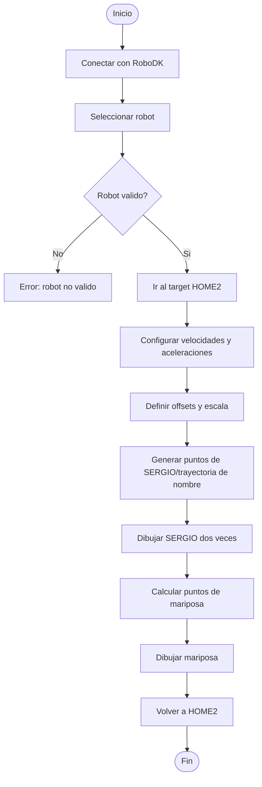

# Laboratorio No. 2 - Robótica Industrial - Análisis y Operación del Manipulador Motoman MH6

## Integrantes

* Sergio Andrés Bolaños Penagos
* Sergio Felipe Rodriguez Mayorga

## Introducción
En esta practica se buscaba trabajar con el manipulador Motoman MH6 de Yaskawa, permitiendo complementar la experiencia en robotica industrial adquirida con el ABB IRB 140 utilizado en el laboratoio 1, razon por la cual en este trabajo se realizo una comparacion detallada entre ambos modelos y el software utilizado para su interaccion. En este laboratorio en particular se implemento una trayectoria polar dibujada por el manipulador la cual consistia en dibujar nuestros nombres (para lo cual se reutilizo la trayectoria previamente diseñada para el ABB), y una mariposa definida en coordenadas polares para aprovechar la facilidad que RoboDK brinda al poder programar en Python.
## Planteamiento del problema
Programar el manipulador motoman MTH6 para que realice una trayectoria definida en coordenadas polares utilizando Python y el software RoboDK .
## Objetivos
* Comprender las diferencias entre las caracterısticas tecnicas del manipulador Motoman MH6 y el IRB140.
* Identificar y describir las configuraciones iniciales del manipulador Motoman MH6, incluyendo el home1 y
home2.
* Realizar movimientos manuales del manipulador Motoman en distintos modos de operacion (articulaciones,
cartesianos, traslaciones y rotaciones).
* Cambiar y controlar los niveles de velocidad para el movimiento manual del manipulador Motoman MH6.
* Comprender las principales aplicaciones del software RoboDK y su comunicacion con el manipulador.
* Comparar y analizar las diferencias entre RobotStudio y RoboDK.
* Diseñar y ejecutar una trayectoria polar en RoboDK y realizar su implementacion fısica en el manipulador Motoman.

## Comparación especificaciones técnicas Motoman MH6 y ABB IRB140
Cuadro comparativo detallado de las características técnicas del Motoman MH6 y el IRB140, incluyendo carga máxima, alcance, número de grados de libertad, velocidad, aplicaciones típicas, etc

| **Características** | **Motoman MH6** | **ABB IRB140** |
|---------------------|-----------------|----------------|
| **Carga máxima**    | 6 kg            | 6 kg           |
| **Alcance máximo (horizontal)** | 1422 mm | 700 mm  |
| **Alcance máximo (vertical)**   | 2486 mm | 1050 mm |
| **Número de grados de libertad**| 6       | 6       |
| **Repetibilidad**               | ± 0.08 mm | ± 0.05 mm |
| **Velocidad máxima (S)** | 220°/s | 150°/s  |
| **Velocidad máxima (L)**  | 200°/s   | 120°/s  |
| **Velocidad máxima (U)** | 220°/s | 120°/s  |
| **Velocidad máxima (R)** | 410°/s | 180°/s  |
| **Velocidad máxima (B)** | 410°/s | 180°/s  |
| **Velocidad máxima (T)** | 610°/s | 220°/s  |
| **Aplicaciones típicas** | Manipulación de materiales, procesamiento, etc. | Manipulación, ensamblaje, soldadura, etc.  |
| **Temperatura de operación**  | 0°C a +45°C| 0°C a +45°C|
| **Peso**| 130 kg  | 240 kg |
| **Tipo de montaje** | Piso, Techo, Pared | Piso, Techo |
### 🔗 Referencias

- [Yaskawa Motoman MH6 – Robots.com](https://www.robots.com/industrial-robots/motoman-mh6)  
- [Yaskawa MH6D/MH6F – Yaskawa Europe PDF](https://pdf.directindustry.com/pdf/yaskawa-europe-gmbh/mh6d-mh6f/14473-309337.html)  
- [ABB IRB 140 Product Specification – ABB Library (3HAC041346)](https://library.e.abb.com/public/a7121292272d40a9992a50745fdaa3b2/3HAC041346%20PS%20IRB%20140-en.pdf)  
- [ABB IRB 140 Datasheet – Manuallib.com](https://www.manuallib.com/download/pdf/2014/0624/abb-irb140-industrial-robot-datasheet.pdf)  
- [IRB 140 Product Manual Type C – Scribd](https://www.scribd.com/document/649705967/IRB-140-Type-C-Product-Manual-3HAC027400-001-RevC-En)

## Diferencias en el home en el Motoman MH6

 El Motoman MH6 cuenta con dos home, HOME1 y HOME2.

* El HOME1 está orientado a la configuración del robot para transporte o almacenamiento durante largas jornadas sin trabajo, es una posición en la que los ejes se encuentran retraidos en su totalidad para disminuir las fuerzas sobre los frenos y el espacio que ocupa el robot.
* El HOME2 está diseñado para cuando el robot se encuentra preparado para trabajar, con el fin de ejecutar sus tareas con facilidad y menores desplazamientos que los que tendría que hacer en HOME1 y facilitar el mantenimiento.

## Movimiento manual, tipos de procedimiento y procedimiento
Procedimiento detallado para realizar movimientos manuales, especificando c´omo cambiar entre modos de
operaci´on (articulaciones, cartesiano) y realizar traslaciones y rotaciones en los ejes X, Y, Z.
 \
Teach pendant
 \
Interfaz del Teach Pendant

1. Dejar el Teach Pendant en modo Teach, y desactivar el botón de emergencia.
2. Definir la velocidad (Slow, Fast, High Speed)
3. Llevar el robot a HOME2 SERVO ON (Botón) > Robot > SECOND HOME POS > Botón hombre muerto + FWD (botón)
4. COORD (Botón) y elegir la opción Joint Coordinates (Robot) o Cartesian Coordinates (Marco de coordenadas), también se puede seleccionar algun otro tipo pero estas son las principales de movimiento articular y movimiento cartesiano.

## Niveles de velocidad

Explicaci´on completa sobre los niveles de velocidad para movimientos manuales, el proceso para cambiar entre
niveles y c´omo identificar el nivel establecido en la interfaz del robot.

El robot tiene 4 modos de velocidad a utilizar, lento, medio y alto, tal como se ve en la imagen, y se cambia entre estos modos con los botones del Teach Pendant SLOW, FAST y HIGH SPEED.

## Aplicaciones  Principales
El Motoman MH6 es un robot industrial de seis ejes diseñado para aplicaciones de manipulación y ensamblaje de alta precisión. Su capacidad de carga de 6 kg y su amplio alcance de 1 422 mm lo hacen especialmente adecuado para tareas como alimentación de máquinas, empaque, paletizado ligero, carga y descarga de piezas, aplicación de adhesivos, dispensado y manipulación de materiales. Gracias a su estructura compacta y su posibilidad de montaje en piso, pared o techo, puede integrarse fácilmente en celdas de trabajo automatizadas. Además, su controlador DX100 ofrece funciones avanzadas de coordinación multirrobot y detección de colisiones, lo que permite una operación segura y eficiente en entornos de manufactura flexible.
## Comunicación con el manipulador

El software RoboDK es una plataforma de simulación y programación offline que permite desarrollar, validar y optimizar trayectorias de robots industriales sin necesidad de disponer del equipo físico. Entre sus principales funcionalidades se incluyen la simulación 3D de manipuladores, la planificación automática de trayectorias, la programación visual o por código, y la exportación directa de programas al controlador del robot.

En el caso del Motoman MH6, RoboDK se comunica con el robot mediante el controlador Yaskawa DX100 (o versiones posteriores como DX200 o YRC1000), utilizando interfaces como Ethernet/IP o MotoCom SDK. El software convierte las trayectorias diseñadas en su entorno virtual en código nativo INFORM (.JBI), que puede ejecutarse directamente en el controlador del robot.

RoboDK también permite la programación en Python, lo que brinda la posibilidad de generar, modificar y controlar trayectorias mediante scripts personalizados. Esto amplía sus capacidades de automatización y facilita la integración con sistemas externos o sensores.

Además, RoboDK funciona como un gemelo digital (digital twin) del manipulador, ya que reproduce en tiempo real el comportamiento cinemático y dinámico del robot dentro del entorno virtual. 

## Comparación RoboDK vs RobotStudio

 

| **Criterio** | **RoboDK** | **RobotStudio** |
|---------------|-------------|-----------------|
| **Fabricante / desarrollador** | RoboDK Inc. (Canadá) | ABB Robotics |
| **Compatibilidad** | Multimarca (Yaskawa, ABB, KUKA, Fanuc, UR, etc.) | Exclusivo para robots ABB( aunque con mas trabajo se pueden incluir otros) |
| **Lenguaje de programación** | Python (nativo) o programacion en bloques, además de generar código específico por postprocesador (INFORM, RAPID, KRL, etc.) | RAPID (lenguaje nativo ABB) |
| **Simulación** | 3D completa, cinemática directa e inversa, detección de colisiones, cálculo de trayectorias y tiempos de ciclo | Simulación 3D avanzada con Virtual Controller (emula el controlador real ABB) |
| **Comunicación con el robot real** | A través del controlador (por Ethernet/IP o transferencia de archivo *.JBI*, *.mod*, etc.) | Comunicación directa con el controlador IRC5/OmniCore mediante Virtual Controller |
| **Nivel de precisión** | Alta, dependiente del postprocesador y la calibración del modelo | Muy alta (usa el mismo firmware que el robot físico) |
| **Programación offline** | Sí, mediante interfaz gráfica y scripts en Python | Sí, mediante RAPID y Virtual Controller |
| **Capacidades de automatización** | Permite integración con visión, sensores externos y control por Python | Incluye librerías industriales (soldadura, pick & place, paletizado, mecanizado, etc.) |
| **Funcionalidad de gemelo digital** | Sí, actúa como un **Digital Twin** del robot en tiempo real | No en su modo mas basico, requiere activar otras opciones para sincronización total con el robot ABB físico |
| **Ventajas principales** | Multimarca, flexible, interfaz sencilla, programación por Python, rápida curva de aprendizaje | Precisión total, integración completa con hardware ABB, simulación realista de procesos |
| **Limitaciones** | Menor fidelidad dinámica, depende de postprocesadores, precisión limitada frente a simuladores nativos | Principalmente compatible con ABB, Rapid tiene una mayor curva de aprendizaje |
| **Aplicaciones típicas** | Investigación, docencia, integración multi-robot, prototipado rápido | Producción industrial ABB, validación de procesos, entrenamiento técnico |
| **Nivel de licencia / costo** | Versión gratuita con funciones limitadas, licencias comerciales asequibles | Licencia comercial (mayor costo, versiones académicas disponibles) |

---

### 🔗 Referencias

- [RoboDK Official Website](https://robodk.com)  
- [RobotStudio Official Page – ABB Robotics](https://new.abb.com/products/robotics/es/robotstudio)  
- [RoboDK Documentation](https://robodk.com/doc/en)  
- [RobotStudio Help and Learning Resources (ABB)](https://developercenter.robotstudio.com/)

## Programación de trayectoria polar

### Diagrama de flujo de acciones del robot

### Plano de planta de la ubicacion de cada uno de los elementos

### Código desarrollado en RoboDK para ejecutar una trayectoria polar, adjuntado como anexo dentro del repositorio.

### Video de simulacion en RoboDK mostrando la trayectoria polar y evidencia de su implementacion en el manipulador Motoman de forma fısica, controlado desde el PC.

