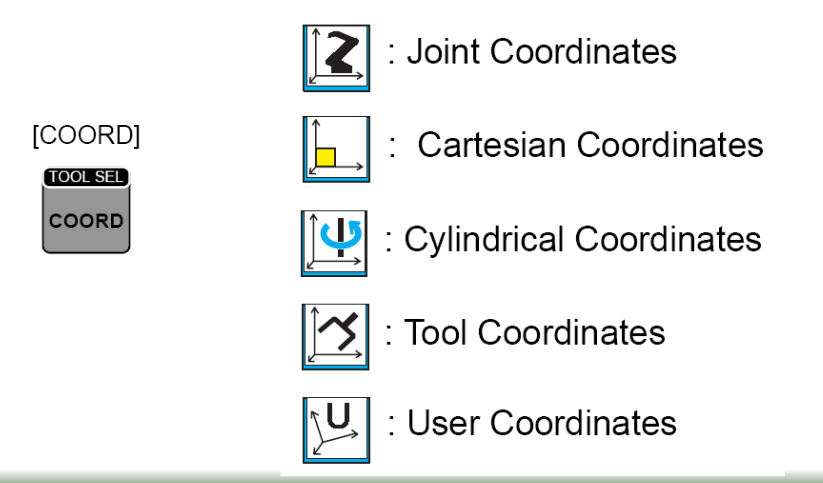

# Laboratorio No. 2 - Robótica Industrial - Análisis y Operación del Manipulador Motoman MH6

## Integrantes

* Sergio Andrés Bolaños Penagos
* Sergio Felipe Rodriguez Mayorga

## Introducción

Los manipuladores industriales son herramientas clave en la automatización industrial. Cada modelo tiene sus propias características técnicas y configuraciones iniciales que los hacen ideales para diferentes aplicaciones.
En este taller, se busca realizar una comparación técnica entre el manipulador Motoman MH6 y el ABB IRB140, comprender las configuraciones iniciales del Motoman MH6, explorar los diferentes modos de operación manual, y realizar simulaciones y ejecuciones reales de trayectorias usando RoboDK.

## Descripción de la práctica

En esta práctica se trabajarán los siguientes temas:
1. Comparación de manipuladores: analizar las diferencias entre el Motoman MH6 y el IRB140 en cuanto a capacidades técnicas, como carga, alcance, velocidad, y aplicaciones.
2. Configuraciones iniciales: describir y diferenciar el home1 y home2 del manipulador Motoman MH6.
3. Movimientos manuales: explicar el procedimiento y las teclas utilizadas para cambiar entre modos de movimiento (articulaciones, cartesianos) y realizar traslaciones y rotaciones.
4. Control de velocidad: detallar los niveles de velocidad disponibles para el movimiento manual del Motoman, cómo realizar cambios entre niveles y cómo identificarlos en la pantalla.
5. Software RoboDK: Describir las principales aplicaciones del software, su función para mover el manipulador
y su comunicación con él.
6. Comparación de herramientas: Analizar las diferencias y usos de RobotStudio y RoboDK.
7. Trayectoria polar: Diseñar, simular y ejecutar una trayectoria polar en RoboDK y realizarla con el manipulador físico.

## Objetivos

* Comprender las diferencias entre las caracterósticas técnicas del manipulador Motoman MH6 y el IRB140.
* Identificar y describir las configuraciones iniciales del manipulador Motoman MH6, incluyendo el home1 y home2.
* Realizar movimientos manuales del manipulador Motoman en distintos modos de operación (articulaciones, cartesianos, traslaciones y rotaciones).
* Cambiar y controlar los niveles de velocidad para el movimiento manual del manipulador Motoman MH6.
* Comprender las principales aplicaciones del software RoboDK y su comunicación con el manipulador.
* Comparar y analizar las diferencias entre RobotStudio y RoboDK.
* Diseñar y ejecutar una trayectoria polar en RoboDK y realizar su implementación física en el manipulador Motoman.

## Comparación especificaciones técnicas Motoman MH6 y ABB IRB140
Cuadro comparativo detallado de las características técnicas del Motoman MH6 y el IRB140, incluyendo carga máxima, alcance, número de grados de libertad, velocidad, aplicaciones típicas, etc

| **Características** | **Motoman MH6** | **ABB IRB140** |
|---------------------|-----------------|----------------|
| **Carga máxima**    | 6 kg            | 6 kg           |
| **Alcance máximo (horizontal)** | 1422 mm | 700 mm  |
| **Alcance máximo (vertical)**   | 2486 mm | 1050 mm |
| **Número de grados de libertad**| 6       | 6       |
| **Repetibilidad**               | ± 0.08 mm | ± 0.05 mm |
| **Velocidad máxima (S)** | 220°/s | 150°/s  |
| **Velocidad máxima (L)**  | 200°/s   | 120°/s  |
| **Velocidad máxima (U)** | 220°/s | 120°/s  |
| **Velocidad máxima (R)** | 410°/s | 180°/s  |
| **Velocidad máxima (B)** | 410°/s | 180°/s  |
| **Velocidad máxima (T)** | 610°/s | 220°/s  |
| **Aplicaciones típicas** | Manipulación de materiales, procesamiento, etc. | Manipulación, ensamblaje, soldadura, etc.  |
| **Temperatura de operación**  | 0°C a +45°C| 0°C a +45°C|
| **Peso**| 130 kg  | 240 kg |
| **Tipo de montaje** | Piso, Techo, Pared | Piso, Techo |

## Diferencias en el home en el Motoman MH6

Descripci´on de las configuraciones home1 y home2 del Motoman MH6, indicando la posici´on de cada articulación, ¿Cual posici´on es mejor?, justifique su respuesta.

El Motoman MH6 cuenta con dos home, HOME1 y HOME2.

* El HOME1 está orientado a la configuración del robot para transporte o almacenamiento durante largas jornadas sin trabajo, es una posición en la que los ejes se encuentran retraidos en su totalidad para disminuir las fuerzas sobre los frenos y el espacio que ocupa el robot.
* El HOME2 está diseñado para cuando el robot se encuentra preparado para trabajar, con el fin de ejecutar sus tareas con facilidad y menores desplazamientos que los que tendría que hacer en HOME1 y facilitar el mantenimiento.

## Movimiento manual, tipos de procedimiento y procedimiento
Procedimiento detallado para realizar movimientos manuales, especificando c´omo cambiar entre modos de
operaci´on (articulaciones, cartesiano) y realizar traslaciones y rotaciones en los ejes X, Y, Z.
 \
Teach pendant
 \
Interfaz del Teach Pendant

1. Dejar el Teach Pendant en modo Teach, y desactivar el botón de emergencia.
2. Definir la velocidad (Slow, Fast, High Speed)
3. Llevar el robot a HOME2 SERVO ON (Botón) > Robot > SECOND HOME POS > Botón hombre muerto + FWD (botón)
4. COORD (Botón) y elegir la opción Joint Coordinates (Robot) o Cartesian Coordinates (Marco de coordenadas), también se puede seleccionar algun otro tipo pero estas son las principales de movimiento articular y movimiento cartesiano.

## Niveles de velocidad

Explicaci´on completa sobre los niveles de velocidad para movimientos manuales, el proceso para cambiar entre
niveles y c´omo identificar el nivel establecido en la interfaz del robot.

El robot tiene 4 modos de velocidad a utilizar, lento, medio y alto, tal como se ve en la imagen, y se cambia entre estos modos con los botones del Teach Pendant SLOW, FAST y HIGH SPEED.

## Aplicaciones principales

## Comunicación con el manipulador

Descripci´on de las principales funcionalidades de RoboDK, explicando c´omo se comunica con el manipulador
Motoman y qu´e procesos realiza para ejecutar movimientos.

## Comparación RoboDK vs RobotStudio

An´alisis comparativo entre RoboDK y RobotStudio, destacando ventajas, limitaciones y aplicaciones de cada
herramienta

## Programación de trayectoria polar

Diagrama de flujo de acciones del robot

Plano de planta de la ubicaci´on de cada uno de los elementos

Código desarrollado en RoboDK para ejecutar una trayectoria polar, adjuntado como anexo dentro del repo
sitorio.

Video de simulaci´on en RoboDK mostrando la trayectoria polar y evidencia de su implementaci´on en el
manipulador Motoman de forma f´ısica, controlado desde el PC.

